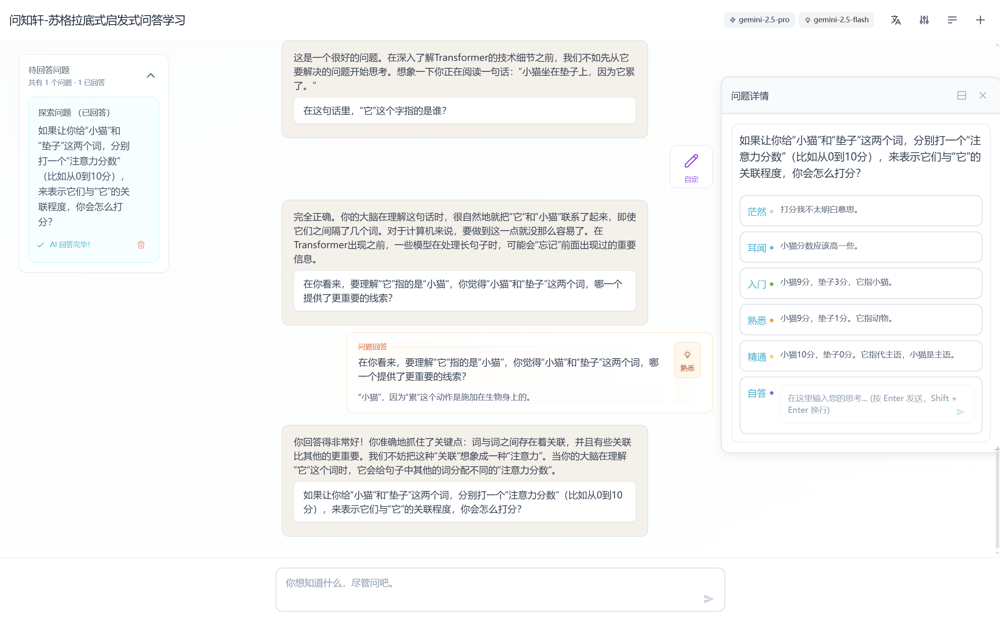
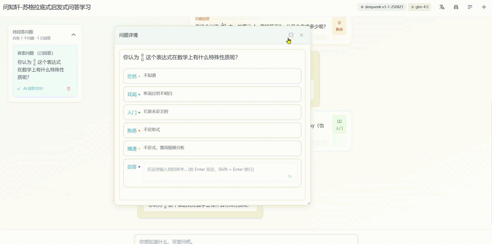
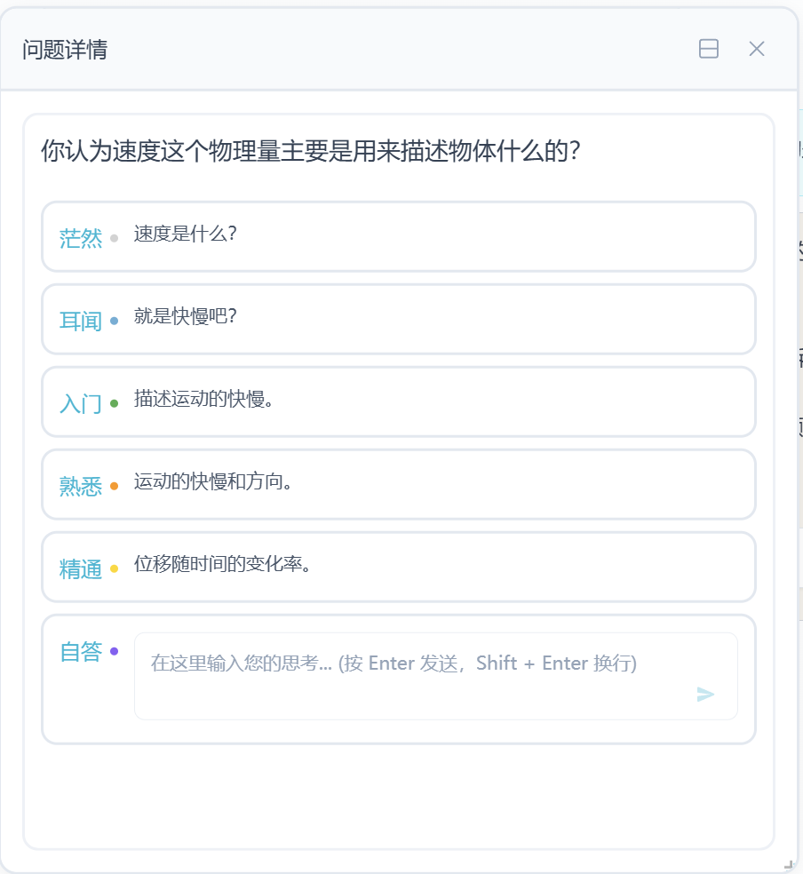
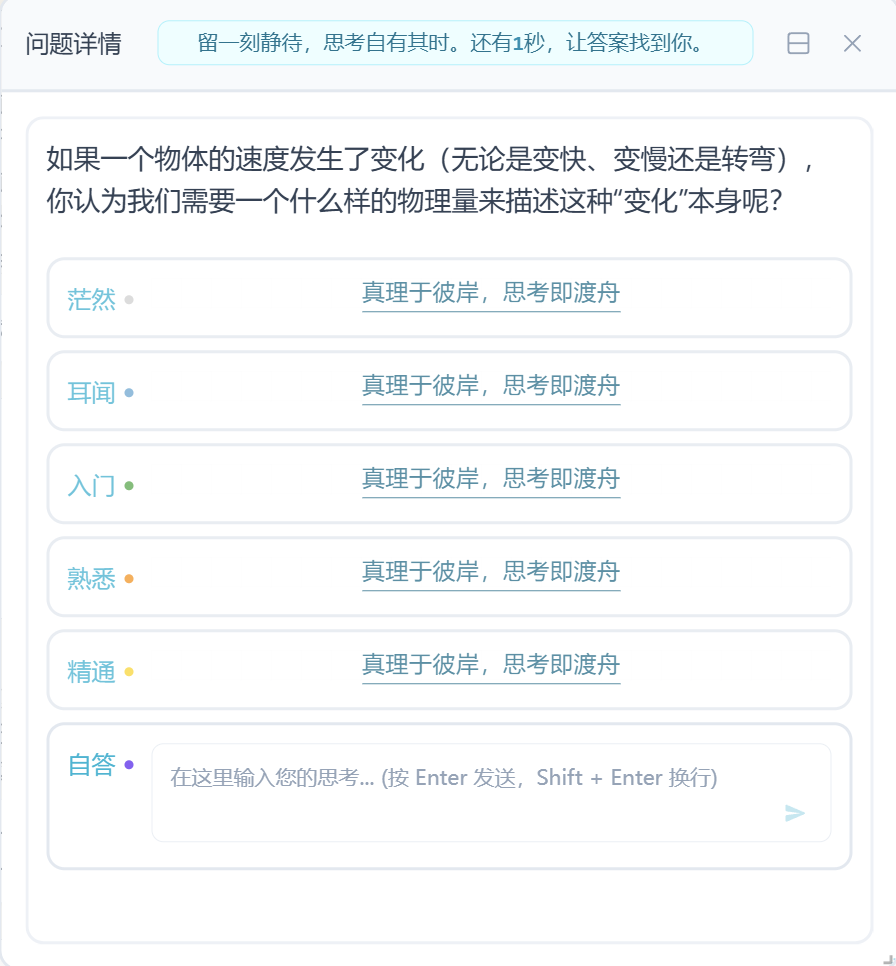
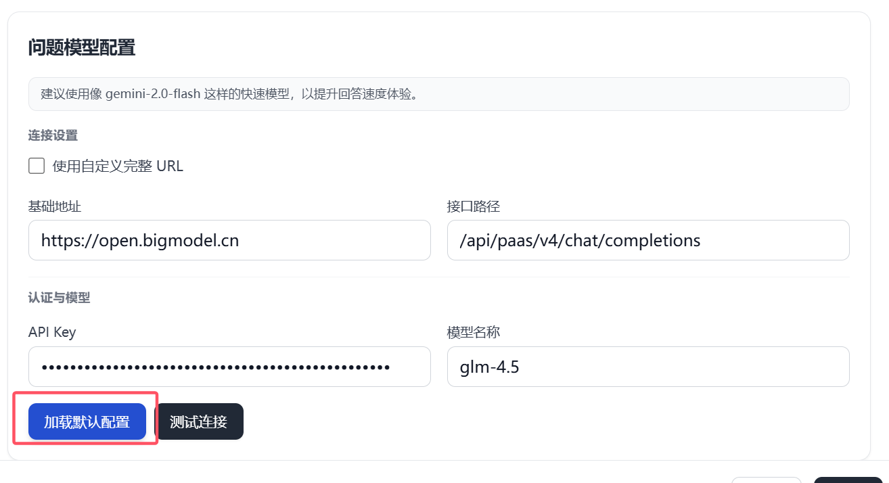
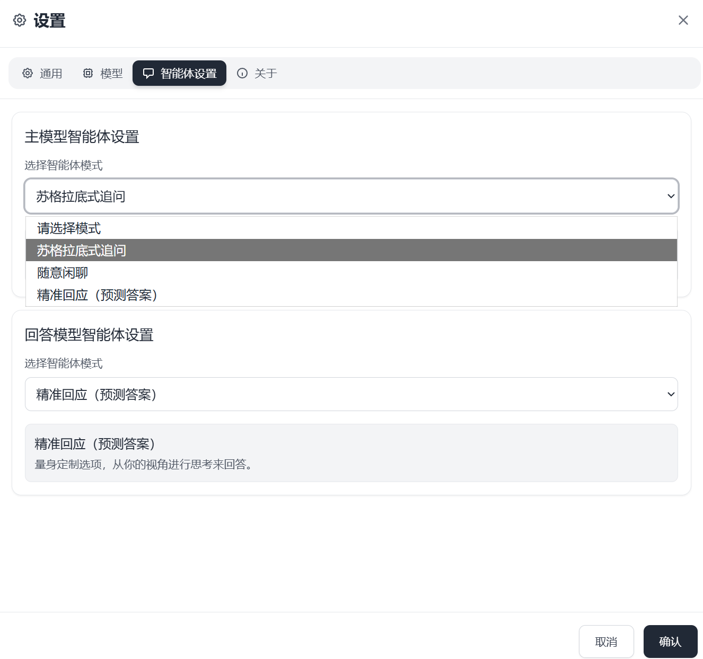

## 项目基本信息
- **项目名称**：问知轩/WisClick-会问，才会学；会答，更会想。
- **项目简介**：一个高度定制的问答交互框架，采用苏格拉底追问式对答，让与AI的对话更有记忆点。
- **演示截图**：

## 项目亮点
- 苏格拉底式追问问答：通过AI提问倒逼用户思考，加深学习印象。
- 高度定制的**交互系统**：**实时**提取AI的问题，AI实时预测回答，点击即可进行交互降低用户输入负担。

- 用AI对提取的问题进行预测，5个等级的回答：茫然、耳闻、入门、熟悉、精通。同时支持自定义回答。
  
- 停顿、思考、回答：在AI回答完毕以后，点开回答卡片，设置延迟限时答案，并且需要鼠标悬停才能查看答案（可以在设置面板中关闭等待），降低对AI的依赖，鼓励使用者思考。
  
- 自定义模型：支持自己填入baseurl和apikey。
- 纯前端，无需后端，即插即用
- 采用localstorage保存数据到本地，apikey不会泄露，支持保存历史对话。
- 支持公式渲染，支持Markdown语法。
- 双语支持

## 安装和使用
- **安装指南**：
  - 环境准备：
    - Node.js 18 或更高版本（建议使用当前 LTS，如 18/20）
    - 包管理器：pnpm（推荐）或 npm/yarn
  - 获取代码：git clone https://github.com/TownBoats/wenzhixuan-public.git
  - 安装依赖（任选其一）：
    - 使用 pnpm：pnpm install
    - 使用 npm：npm install
  - 本地开发：
    - 启动开发服务器：
      - pnpm dev 或 npm run dev 
      - 访问http://localhost:5173
 
## 版本要求
- 运行时环境：
  - Node.js：18+（LTS 推荐，20+ 也可）
  - 包管理器：pnpm 8+（推荐）或 npm/yarn 任一
  - 浏览器：现代浏览器的最近版本
- 关键依赖：
  - Vite 6.x
  - React 18.x，React DOM 18.x
  - React Router DOM 7.x
  - Tailwind CSS 3.x
  - 其他：i18next、react-i18next、styled-components、framer-motion、react-markdown 等
- 其他说明：
  - 本项目为纯前端应用，无需后端即可运行.

## 直接体验
- **在线演示**：访问[项目在线演示](https://wenzhixuan.com)
- 提供限时的690万tokens glm4.5试用，模型配置面板点击“加载默认配置”即可
  

## 使用方法
- 打开项目在线演示[项目在线演示](https://wenzhixuan.com)
- 点击“加载默认配置”，可使用glm4.5模型（token有限，并发有限，推荐使用自己的api）
- 输入讨论的问题，点击“发送”，即可与AI对话
- 设置面板中的“智能体设置”选择“苏格拉底追问”即打开追问模式，选择“随意闲聊”即关闭追问，打开普通聊天模式。

## 其他
- **许可证**：MIT License
  Copyright (c) 2025 WisClick
- **其他项目**：[CodeMerge](https://github.com/TownBoats/codeMerge.git):一个AI友好的代码合并工具。欢迎star

